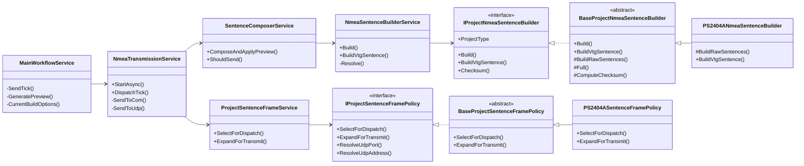

# NMEASender WPF 가이드


## 1. 프로젝트가 하는 일

`NMEASender.Wpf`는 시뮬레이터 데이터 또는 수동 입력 데이터를 기반으로 NMEA Sentence를 생성해서 COM 포트와 UDP로 송신하는 WPF 프로그램이다.

주요 기능은 아래와 같다.

- NMEA Sentence 생성 및 미리보기
- Sentence별 COM 송신 여부 선택
- Sentence별 UDP 송신 여부 선택
- COM 포트별 BaudRate 설정
- Sentence별 UDP 포트 설정
- Sentence별 Multicast 주소 설정
- 상단 툴바 Sentence 검색(문장명/ID/NMEA #1/NMEA #2)
- Settings > Sentence UDP Endpoint 검색 + x 일괄 클리어
- 프로젝트별 NMEA 생성 규칙 분리
- PS2404A 전용 NMEADrv 호환 로직 지원
- 로그 자동 스크롤 및 수동 스크롤 제어

운영/사용 절차는 `docs/OPERATION_MANUAL.md`를 참고하면 된다.

## 2. 먼저 봐야 하는 파일 순서

처음 분석할 때는 아래 순서대로 보는 게 제일 편하다.

1. `App.xaml.cs`
2. `ViewModels/Shell/MainViewModel.cs`
3. `ViewModels/Shell/MainStateStore.cs`
4. `Services/Workflow/MainWorkflowService.cs`
5. `Services/Transmission/NmeaTransmissionService.cs`
6. `Services/Transmission/SentenceComposerService.cs`
7. `Services/Transmission/NmeaSentenceBuilderService.cs`
8. `Services/Projects/BaseProjectNmeaSentenceBuilder.cs`
9. `Services/Projects/PS2404A/PS2404ANmeaSentenceBuilder.cs`
10. `Services/Projects/PS2404A/PS2404ASentenceFramePolicy.cs`
11. `Services/Config/NmeaSenderConfigService.cs`

이 순서가 중요한 이유는 실제 실행 흐름이 거의 이 순서대로 이어지기 때문이다.

## 3. 전체 구조

폴더는 레이어와 책임 기준으로 나뉘어 있다.

```text
NMEASender.Wpf
├─ Views
│  ├─ Shell
│  ├─ Panels
│  └─ Dialogs
├─ ViewModels
│  ├─ Shell
│  ├─ Panels
│  └─ Dialogs
├─ Models
│  ├─ Core
│  ├─ UI
│  ├─ Network
│  ├─ Projects
│  ├─ SharedMemory
│  └─ Ais
├─ Services
│  ├─ Workflow
│  ├─ Transmission
│  ├─ Projects
│  ├─ Config
│  ├─ IO
│  ├─ Network
│  ├─ Ports
│  ├─ Search
│  ├─ Mapping
│  └─ Application
└─ Styles
```

큰 기준은 이렇다.

- `Views`: 화면 XAML
- `ViewModels`: 화면 바인딩용 상태와 Command
- `Models`: 데이터 구조
- `Services`: 실제 업무 로직
- `Services/Interfaces`: 서비스 추상화
- `Services/Projects`: 프로젝트별 차이점
- `Services/Search`: 검색 규칙 공통 서비스
- `Styles`: WPF 스타일

## 4. DI 등록 구조

의존성 주입은 `App.xaml.cs`에서 한다.

중요한 등록은 아래 그룹이다.

- Config
  - `INmeaSenderConfigService`
  - `NmeaSenderConfigService`
- Transmission
  - `INmeaTransmissionService`
  - `INmeaSentenceBuilderService`
  - `ISentenceComposerService`
  - `ISentenceCatalogService`
- Project 정책
  - `IProjectNmeaSentenceBuilder`
  - `IProjectSentenceFramePolicy`
  - `IProjectSentenceComposerProfile`
  - `IProjectSentenceCatalogPolicy`
  - `IProjectSendFlagCodec`
  - `IProjectUdpTransportProfileStore`
- Workflow
  - `IMainWorkflowService`
  - `MainWorkflowService`
- Search
  - `ISentenceSearchService`
  - `SentenceSearchService`
- ViewModel / View
  - `MainViewModel`
  - `MainWindow`

새 프로젝트 타입을 추가할 때는 `App.xaml.cs` 등록을 반드시 확인해야 한다.

## 5. MVVM 흐름

### 5.1 MainWindow

메인 윈도우는 `Views/Shell/MainWindow.xaml`이다.

이 파일은 전체 화면을 조립하는 Shell 역할만 한다.

실제 화면은 아래 View로 나뉜다.

- `Views/Panels/TopToolbarView.xaml`
- `Views/Panels/ManualLogView.xaml`
- `Views/Panels/SentencePanelView.xaml`

### 5.2 MainViewModel

`ViewModels/Shell/MainViewModel.cs`는 Shell ViewModel이다.

직접 복잡한 업무 로직을 처리하지 않고, 패널별 ViewModel을 연결한다.

### 5.3 MainStateStore

`ViewModels/Shell/MainStateStore.cs`는 공통 UI 상태 저장소다.

여기에 들어가는 대표 상태:

- COM 포트 목록
- GPS Sentence 목록
- Other Sentence 목록
- Internal Sentence 목록
- 로그 목록
- 현재 START/STOP 상태
- 전체 COM/UDP 체크 상태
- 수동 입력값

여러 ViewModel과 Service가 공유해야 하는 상태는 이쪽에 있다.

### 5.4 Panel ViewModel

패널별 ViewModel은 각 화면의 Command와 Binding만 담당한다.

- `TopToolbarViewModel`
  - START
  - STOP
  - APPLY
  - Sentence 검색어 입력/클리어
  - Settings
  - Exit
- `ManualLogViewModel`
  - Manual Data 입력
  - Get Data
  - Set Data
  - Clear Log
- `SentencePanelViewModel`
  - Sentence 추가
  - Sentence 삭제
  - 전체 COM/UDP 체크
  - `CollectionView` 필터 기반 검색 결과 표시

복잡한 로직은 ViewModel 안에 직접 넣지 말고 `MainWorkflowService`로 넘기는 구조다.

### 5.5 Sentence 검색 구조

검색 기능은 ViewModel에 문자열 매칭 로직을 직접 두지 않고 서비스로 분리했다.

관련 클래스:

- `Services/Interfaces/Search/ISentenceSearchService.cs`
- `Services/Search/SentenceSearchService.cs`
- `ViewModels/Panels/TopToolbarViewModel.cs`
- `ViewModels/Panels/SentencePanelViewModel.cs`
- `ViewModels/Dialogs/PortBaudRateSettingsViewModel.cs`
- `Services/Ports/BaudRateSettingService.cs`

메인 화면 검색:

- 검색어 상태: `MainStateStore.SentenceSearchText`
- 입력 UI: `TopToolbarView`
- 필터 적용: `SentencePanelViewModel`의 `GpsSentencesView` / `OtherSentencesView`
- 검색 대상: `Label`, `Id`, `PrimaryText`, `SecondaryText`

Settings 검색:

- 검색어 상태: `PortBaudRateSettingsViewModel.SentenceUdpSearchText`
- 대상 리스트: `FilteredSentenceUdpPorts`
- 검색 대상: `RowKey`, `SentenceLabel`, `UdpPort`, `UdpAddress`

## 6. 핵심 Workflow

화면 동작 대부분은 `Services/Workflow/MainWorkflowService.cs`에서 시작한다.

대표 메서드:

- `StartAsync()`
- `Stop()`
- `OpenSettings()`
- `SetData()`
- `GetData()`
- `ApplyDefaultPort()`
- `ApplyDefaultUdpPort()`
- `AddSentenceRow()`
- `RemoveSentenceRow()`
- `RefreshPorts()`
- `ClearLog()`
- `SendTick()`

### 6.1 START 버튼

START 버튼을 누르면 흐름은 대략 이렇게 간다.

```text
TopToolbarViewModel.StartCommand
-> MainWorkflowService.StartAsync()
-> SharedMemory 또는 Manual Data 갱신
-> COM/UDP 활성화 상태 확인
-> NmeaTransmissionService.StartAsync()
-> COM/UDP Open
-> Timer Start
-> SendTick()
```

START 시 COM이 하나도 체크되어 있지 않아도 UDP가 체크되어 있으면 UDP Only로 동작한다.

### 6.2 STOP 버튼

```text
TopToolbarViewModel.StopCommand
-> MainWorkflowService.Stop()
-> NmeaTransmissionService.Stop()
-> OutputChannelService.CloseAll()
```

## 7. NMEA Sentence 생성 흐름

NMEA 생성 흐름은 이 프로젝트에서 가장 중요하다.

전체 흐름은 아래와 같다.

```text
MainWorkflowService.SendTick()
-> NmeaTransmissionService.DispatchTick()
-> SentenceComposerService.ComposeAndApplyPreview()
-> NmeaSentenceBuilderService.Build()
-> Project별 IProjectNmeaSentenceBuilder.Build()
-> BaseProjectNmeaSentenceBuilder.Build()
-> BuildRawSentences()
-> Full()
-> ApplyTalkerProfile()
-> ProjectSentenceFrameService.ExpandForTransmit()
-> COM/UDP 송신
```

### 7.1 MainWorkflowService.SendTick

`SendTick()`은 주기 송신의 시작점이다.

하는 일:

- 현재 데이터 갱신
- COM 또는 UDP 체크된 Sentence만 수집
- UDP 포트와 전송 옵션 계산
- `NmeaBuildOptions` 생성
- `TransmissionTickContext` 생성
- `NmeaTransmissionService.DispatchTick()` 호출

여기서는 문장을 직접 만들지 않는다.

### 7.2 NmeaTransmissionService.DispatchTick

`NmeaTransmissionService`는 송신 루프를 담당한다.

하는 일:

- 프로젝트 정책으로 이번 Tick에 보낼 Sentence 선택
- Sentence 생성 요청
- 프로젝트별 프레임 확장
- COM 송신
- UDP 송신

핵심 메서드:

- `DispatchTick()`
- `SendToCom()`
- `SendToUdp()`

### 7.3 SentenceComposerService

`SentenceComposerService`는 `SentenceItem` 하나를 실제 NMEA 문자열로 바꾼다.

핵심 메서드:

- `ComposeAndApplyPreview()`
- `ShouldSend()`

`ComposeAndApplyPreview()`는 문장을 생성한 뒤 UI 미리보기에도 반영한다.

```text
item.PrimaryText
item.SecondaryText
```

IOS Source일 때 Fail Flag가 있으면 `ShouldSend()`에서 특정 문장을 막는다.

예:

- GPS Fail이면 `GGA`, `GLL`, `RMC`, `VTG`, `ZDA` 송신 안 함
- Gyro Fail이면 `HDT` 송신 안 함
- Log Fail이면 `VBW` 송신 안 함
- Echo Fail이면 `DBT`, `DPT` 송신 안 함

### 7.4 NmeaSentenceBuilderService

`NmeaSentenceBuilderService`는 이름 때문에 헷갈릴 수 있는데, 실제 문장 생성기라기보다는 프로젝트별 Builder 선택자다.

하는 일:

- 등록된 `IProjectNmeaSentenceBuilder` 목록을 보관
- `NmeaBuildOptions.ProjectType`을 보고 적절한 Builder 선택
- 선택한 Builder에게 `Build()` 위임

즉, 이 클래스는 “누가 만들지 고르는 역할”이다.

### 7.5 BaseProjectNmeaSentenceBuilder

`BaseProjectNmeaSentenceBuilder`는 프로젝트별 Builder들의 공통 기반이다.

하는 일:

- 기본 NMEA 문장 생성
- Checksum 계산
- `$...*CS\r\n` 형태 완성
- AIS 문장일 때 `!` prefix 처리
- Talker ID 적용
- 좌표/시간/속도 포맷 공통 처리

핵심 메서드:

- `Build()`
- `BuildRawSentences()`
- `Full()`
- `ComputeChecksum()`
- `ApplyTalkerProfile()`
- `ReplaceTalkerId()`

`BuildRawSentences()`에서 `NmeaSentenceId`별 기본 문장을 만든다.

예:

- `Gga` -> `BuildGga()`
- `Rmc` -> `BuildRmc()`
- `Vtg` -> `BuildVtg()`
- `Dpt` -> `BuildDpt()`
- `Vdm` -> `BuildVdm()`

### 7.6 PS2404ANmeaSentenceBuilder

`Services/Projects/PS2404A/PS2404ANmeaSentenceBuilder.cs`는 PS2404A 전용 문장 생성 클래스다.

Base와 다른 문장은 여기서 override한다.

PS2404A에서 별도 생성하는 문장:

- `GGA`
- `GLL`
- `RMC`
- `VTG`
- `VDVBW`
- `RPM PORT`
- `RPM STBD`
- `DPT`
- `VHW`
- `VDR`
- `DTM`
- `GPDTM`
- `THS`
- `MWS`
- `MWH`
- `HTD`
- `TTM`

그 외 문장은 Base 로직을 사용한다.

```csharp
_ => base.BuildRawSentences(id, data, derived, options)
```

PS2404A 전용 차이:

- 좌표 포맷이 다름
- `GLL`, `VTG` 등에 Mode Indicator가 붙음
- KSOE 데이터가 있으면 `RMC`, `VTG`, `VHW`에서 KSOE 값 우선 사용
- `RPM` 포맷이 다름
- `DPT` 포맷이 다름
- `VDVBW`는 별도 계산식 사용
- Talker ID override가 많음

## 8. 송신 프레임 정책

NMEA 문자열을 만든 뒤 실제 송신 직전에 프로젝트별 프레임 정책을 적용한다.

관련 클래스:

- `ProjectSentenceFrameService`
- `BaseProjectSentenceFramePolicy`
- `PS2404ASentenceFramePolicy`

### 8.1 ProjectSentenceFrameService

`ProjectSentenceFrameService`는 `ProjectType`에 맞는 Frame Policy를 선택한다.

하는 일:

- 이번 Tick에 보낼 Sentence 선택
- 문장 프레임 확장
- UDP 포트 결정
- UDP 주소 결정

### 8.2 BaseProjectSentenceFramePolicy

기본 정책이다.

- 전달받은 Sentence 그대로 송신
- Sentence별 UDP Port 지원
- Multicast 모드일 때 프로젝트가 지원하면 Sentence별 UDP Address 사용

### 8.3 PS2404ASentenceFramePolicy

PS2404A 전용 송신 정책이다.

특징:

- PORT/STBD RPM이 둘 다 켜져 있으면 Tick마다 하나씩 교대 송신
- `$`로 시작하는 문장은 `1$...`, `2$...` 두 개로 확장
- `!`로 시작하는 AIS 문장은 동일 문장을 2번 송신
- Sentence별 Multicast 주소 지원

즉, PS2404A는 문장 생성뿐 아니라 송신 형태도 별도 정책을 가진다.

## 9. 설정 파일 구조

설정은 `Services/Config/NmeaSenderConfigService.cs`가 담당한다.

기본 설정 파일:

```text
NMEASender.Wpf.ini
```

주요 섹션:

- `[CONFIG]`
- `[GPS CONFIG]`
- `[SENTENCE PORTS]`
- `[BAUD RATE]`

프로젝트 타입은 `[CONFIG]`의 `Project` 값으로 결정된다.

```ini
[CONFIG]
Project=PS2404A
```

프로젝트 값이 없거나 알 수 없는 값이면 표준/default 프로젝트인 `PS000`으로 동작한다.

UDP 관련 설정은 메인 INI에 저장하지 않고 아래 파일로 분리한다.

```text
UDPConfig.ini
```

`UDPConfig.ini` 주요 섹션:

- `[UDP CONFIG]`
- `[UDP PORTS]`
- `[UDP ADDRESSES]`
- `[BROADCAST]`
- `[MULTICAST]`

관련 클래스:

- `PS2404AUdpTransportProfileStore`
- `UdpTransportProfileService`
- `UdpTransportOptions`

## 10. 데이터 모델

### 10.1 NmeaDataDto

`Models/Core/NmeaDataDto.cs`

NMEA 문장 생성에 필요한 원본 데이터가 들어간다.

대표 값:

- 위치
- 속도
- Heading
- GyroHeading
- MagneticVariation
- RPM
- Rudder
- Wind
- WaterDepth
- TrafficShips
- SimulationTimeSeconds

### 10.2 NmeaDerivedData

`Models/Core/NmeaDerivedData.cs`

원본 데이터에서 파생 값을 계산한다.

예:

- Course Over Ground
- Speed Over Ground
- Water Speed
- Magnetic Heading
- Longitudinal/Lateral Knots

### 10.3 SentenceItem

`Models/UI/SentenceItem.cs`

화면의 Sentence 한 줄을 나타낸다.

대표 값:

- `Id`
- `Flag`
- `Label`
- `PortName`
- `IsComEnabled`
- `IsUdpEnabled`
- `UdpPort`
- `UdpAddress`
- `PrimaryText`
- `SecondaryText`
- `IsDuplicateRow`

## 11. 프로젝트별 로직 추가 방법

새 프로젝트를 추가해야 한다면 이 순서로 진행하면 된다.

1. `Models/Projects/ProjectModels.cs`에 `ProjectType` 추가
2. `Services/Projects/<PROJECT_CODE>` 폴더 생성
3. 필요한 프로젝트별 클래스 작성
4. `App.xaml.cs`에 DI 등록
5. INI `Project` 값 파싱/저장 로직 확인
6. Sentence 목록 노출 정책 확인
7. 빌드 후 실제 송신 로그 확인

프로젝트별로 자주 필요한 클래스:

- `<Project>NmeaSentenceBuilder`
- `<Project>SentenceFramePolicy`
- `<Project>SentenceComposerProfile`
- `<Project>SentenceCatalogPolicy`
- `<Project>SendFlagCodec`
- `<Project>UdpTransportProfileStore`

표준 NMEA 그대로 사용하는 기준 프로젝트는 `PS000`이다. 프로젝트별 override가 필요 없는 경우 `PS000` 동작을 기준으로 비교하면 된다.

## 12. 수정할 때 지켜야 할 기준

### 12.1 ViewModel에 무거운 로직 넣지 말기

ViewModel은 화면 바인딩과 Command 중심으로 유지한다.

업무 로직은 Service로 보낸다.

### 12.2 Base 클래스에 프로젝트 전용 로직 넣지 말기

예를 들어 PS2404A만 다른 계산식이 있다면 Base에 `if (ProjectType == PS2404A)` 같은 코드를 넣지 않는다.

대신 `Services/Projects/PS2404A` 아래의 전용 클래스에서 override한다.

### 12.3 서비스에는 인터페이스를 같이 둔다

새 서비스를 만들면 가능한 한 `Services/Interfaces` 아래에 인터페이스를 같이 만든다.

### 12.4 문장 생성과 송신 프레임을 구분한다

문장 내용 자체가 다르면 `IProjectNmeaSentenceBuilder` 쪽이다.

송신 직전 형태가 다르면 `IProjectSentenceFramePolicy` 쪽이다.

예:

- `RMC` 필드 구성이 다름 -> Builder
- `$GPGGA`를 `1$GPGGA`, `2$GPGGA`로 보냄 -> FramePolicy
- RPM을 PORT/STBD 교대 송신 -> FramePolicy

### 12.5 var 사용하지 않기

현재 코드 스타일은 명시 타입을 사용한다.

새 코드에서도 `var` 대신 명시 타입을 쓰는 편이 좋다.

## 13. 자주 보는 디버깅 포인트

### 13.1 문장이 안 만들어질 때

확인 순서:

1. `SentenceItem.Id`가 맞는지 확인
2. `SentenceComposerService.ComposeAndApplyPreview()` 진입 여부 확인
3. `NmeaSentenceBuilderService.Resolve()`가 올바른 Builder를 고르는지 확인
4. 해당 Project Builder의 `BuildRawSentences()`에 case가 있는지 확인
5. 없으면 Base의 `BuildRawSentences()`에서 처리되는지 확인

### 13.2 미리보기는 되는데 송신이 안 될 때

확인 순서:

1. `SentenceItem.IsComEnabled`
2. `SentenceItem.IsUdpEnabled`
3. COM 포트가 실제로 열려 있는지
4. UDP가 열려 있는지
5. `NmeaTransmissionService.DispatchTick()`에서 `SendToCom()` 또는 `SendToUdp()`가 호출되는지

### 13.3 PS2404A만 다르게 나올 때

확인 순서:

1. INI의 `Project=PS2404A` 확인
2. `App.xaml.cs`에서 PS2404A Builder 등록 확인
3. `PS2404ANmeaSentenceBuilder.BuildRawSentences()` 확인
4. `PS2404ASentenceFramePolicy.ExpandForTransmit()` 확인
5. `PS2404AUdpTransportProfileStore` 확인

### 13.4 UDP Multicast가 안 될 때

확인 순서:

1. 설정창에서 Multicast 모드인지 확인
2. Multicast Address가 `224.0.0.0` - `239.255.255.255` 범위인지 확인
3. Sentence 행별 `UdpAddress` 확인
4. Sentence 행별 `UdpPort` 확인
5. `BaseProjectSentenceFramePolicy.ResolveUdpAddress()` 확인
6. `UdpService` 송신 로그 확인

### 13.5 검색 결과가 이상할 때

확인 순서:

1. 메인 검색어: `MainStateStore.SentenceSearchText`
2. 메인 필터 적용 여부: `SentencePanelViewModel.FilterSentence()`
3. 본문 미리보기 최신화 여부: `SentenceItem.PrimaryText`, `SentenceItem.SecondaryText`
4. 설정 검색어: `PortBaudRateSettingsViewModel.SentenceUdpSearchText`
5. 설정 필터 리스트: `FilteredSentenceUdpPorts`
6. 공통 검색 규칙: `SentenceSearchService`

## 14. 빌드와 확인

일반 빌드:

```bash
dotnet build
```

실행 파일 잠금 문제를 피하고 싶으면:

```bash
dotnet build /p:UseAppHost=false
```

변경 후 최소 확인:

1. 빌드 성공
2. START 가능
3. TEST 모드에서 NMEA Preview 갱신
4. UDP Only 송신 가능
5. COM 송신 가능
6. PS2404A에서 `1$`, `2$` 프레임 확장 확인
7. PS2404A RPM PORT/STBD 교대 확인
8. 상단 Sentence 검색 시 GPS/Other 리스트 필터 정상 동작
9. Settings > Sentence UDP Endpoint 검색/클리어 정상 동작

## 15. 클래스 다이어그램



## 16. 최종 요약

이 프로젝트는 크게 네 축으로 보면 된다.

- 화면 상태와 명령: `ViewModels`
- 전체 업무 흐름: `MainWorkflowService`
- NMEA 생성과 송신: `Services/Transmission`
- 프로젝트별 차이: `Services/Projects`

처음 코드를 볼 때는 `MainWorkflowService.SendTick()`에서 시작해서 `NmeaTransmissionService`, `SentenceComposerService`, `NmeaSentenceBuilderService`, 프로젝트별 Builder 순서로 따라가면 대부분의 흐름이 잡힌다.

새 기능을 넣을 때는 먼저 이 기능이 “공통 기능인지”, “프로젝트별 기능인지”, “문장 생성인지”, “송신 정책인지”를 구분하고 들어가면 구조가 크게 무너지지 않는다.
